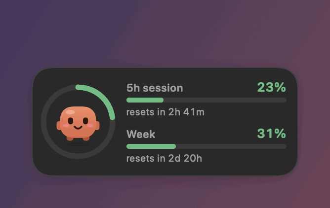
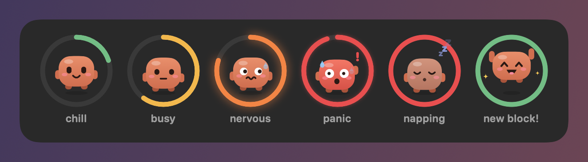
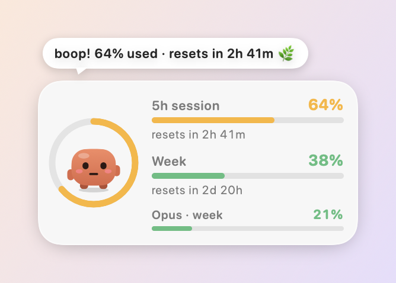
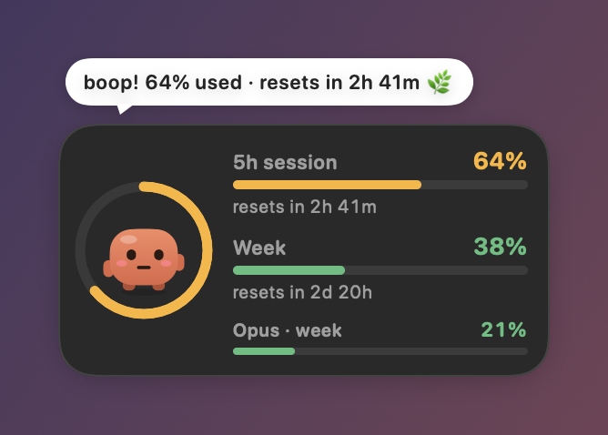
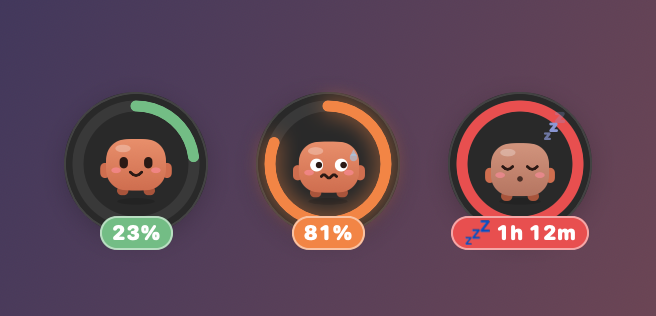
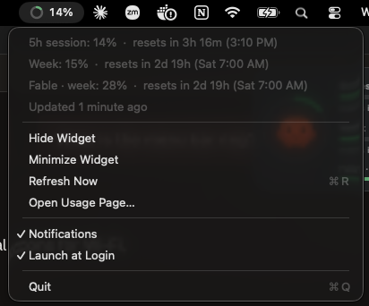

# Claude Usage Popup 🧡

A tiny floating widget for your Mac that shows how much of your Claude plan you've used, so you don't have to keep checking claude.ai/settings/usage.

Meet **Tok**, your little token buddy. Tok stays calm while you have plenty of usage left, sweats as you get close to the limit, naps when you run out, and celebrates with confetti when a new block starts.

<p align="center">
  
</p>

## Install

Paste this into Terminal:

```bash
curl -fsSL https://raw.githubusercontent.com/gulnuravci/claude-usage-pop-up/main/get.sh | bash
```

That's it! It downloads the app, puts it in your Applications folder, and starts it. It also launches automatically when you log in.

You need macOS 13 or newer, and you need to have logged into [Claude Code](https://docs.claude.com/en/docs/claude-code) at least once on this Mac. If you use Conductor, you already have. Wondering what it does with your login? See [Is this safe?](#is-this-safe)

<details>
<summary>Prefer to build it yourself from source?</summary>

```bash
git clone https://github.com/gulnuravci/claude-usage-pop-up.git
cd claude-usage-pop-up
./install.sh
```

This needs Apple's command line tools. If it says "Swift isn't installed", run `xcode-select --install`, click through the installer, then run `./install.sh` again.

</details>

### Quit and start it again

- **Quit:** click the ring in your menu bar → **Quit**.
- **Start it again:** run this in Terminal:

  ```bash
  open -a "Claude Usage Popup"
  ```

  Or open your **Applications** folder in Finder and double-click **Claude Usage Popup**. It also starts on its own the next time you log in.
- **Just hid the widget?** It's still running. Click the ring in your menu bar → **Show Widget**.

### Update

Run the install command again:

```bash
curl -fsSL https://raw.githubusercontent.com/gulnuravci/claude-usage-pop-up/main/get.sh | bash
```

It swaps in the newest version and restarts it. Your widget's position and settings stay the same. Installing on another Mac works the same way. (Built from source? Run `git pull && ./install.sh` in the repo folder instead.)

### Uninstall

```bash
curl -fsSL https://raw.githubusercontent.com/gulnuravci/claude-usage-pop-up/main/uninstall.sh | bash
```

This quits the app, deletes it, and clears its settings. If you cloned the repo, `./uninstall.sh` does the same.

<p align="center">
  
</p>

## What you get

- **A floating card** that stays on top of your windows on every desktop. It shows your **5-hour session**, your **weekly limit**, and any per-model weekly limits, each with a reset countdown. It matches your Mac's light or dark mode.

   

- **A minimized mode**: just Tok in the ring with a tiny % tag, for when you want it out of the way.

  

- **A menu bar ring** with your session %, so you can see it even when the widget is hidden. Click it for every limit, exact reset times, and settings.

  

- **Heads-ups** at 75%, 90%, and 100%: Tok shakes, says something in a speech bubble, and you get a macOS notification.
- **Confetti** 🎉 when your 5-hour block or your week resets.

It works with Claude Pro and Max plans, including usage from Claude Code, Conductor, and claude.ai chats.

## Is this safe?

Short version: you never hand it a key, and your login never leaves your Mac except to go to Anthropic.

- **No API key, no pasting.** The widget uses the login Claude Code already saved in your Mac's Keychain.
- **It only talks to Anthropic.** Your token goes to `api.anthropic.com`, the same place Claude Code sends it, and nowhere else. There's no server of ours, no analytics, and no tracking. The author can't see who installed it or what anyone's usage is.
- **It doesn't store your token.** The widget reads the token when it checks your usage and keeps it only in memory for that request. The only thing it saves is your latest usage numbers (percentages and reset times), so a restart can show them right away.
- **It's read-only.** It never changes, refreshes, or copies your login. Claude Code manages that.

One honest note: the token Claude Code saves is your full Claude login, not a "usage-only" key. So you're trusting this code to do only what it says. It's small and open source. The whole path the token takes is in [`UsageAPI.swift`](Sources/ClaudeUsagePopup/UsageAPI.swift), about 100 lines. Please give it a read!

## Using it

| Do this | To |
| --- | --- |
| Drag the card | Move it anywhere (it remembers the spot) |
| Hover and click the **–** in the corner | Minimize to just Tok in the ring |
| Click minimized Tok | Expand back to the full card |
| Click Tok on the full card | Refresh now and get a status report |
| Right-click the widget | Minimize or expand, refresh, open the usage page, or hide the widget |
| Click the menu bar ring | See all limits with exact reset times, refresh, open the usage page, show, hide, minimize, or expand the widget, turn notifications or launch-at-login on and off, or quit |

## How it works

Claude Code saves your login in the macOS Keychain (under `Claude Code-credentials`). Every 2 minutes, the widget reads that token and asks Anthropic for your usage, using the same endpoint Claude Code's `/usage` command uses:

```
GET https://api.anthropic.com/api/oauth/usage
```

See [Is this safe?](#is-this-safe) for exactly what happens with your login.

The code is small and easy to read. Everything is in [`Sources/ClaudeUsagePopup`](Sources/ClaudeUsagePopup):

| File | What's inside |
| --- | --- |
| `UsageAPI.swift` | Reads your login and fetches usage |
| `UsageStore.swift` | Polling, moods, and when to shake, speak, or throw confetti |
| `Mascot.swift` | Tok, drawn and animated in code |
| `WidgetView.swift` | The card, rings, and progress bars |
| `Config.swift` | Thresholds, poll interval, colors: **tweak me!** |

## Customizing

Open `Sources/ClaudeUsagePopup/Config.swift`, change what you like (warning thresholds, poll interval, bubble duration), then run `./install.sh` again.

To see every animation without spending real tokens, run the demo. It fakes a session that fills up and resets about every 20 seconds:

```bash
swift run ClaudeUsagePopup --demo
```

## Troubleshooting

First, check whether the app can see your usage:

```bash
/Applications/Claude\ Usage\ Popup.app/Contents/MacOS/ClaudeUsagePopup --check
```

(If your Mac didn't let the installer use the main Applications folder, it's in `~/Applications` instead.)

(From a clone of the repo, `swift run ClaudeUsagePopup --check` does the same.)

- **"No Claude Code login found"**: run `claude` in a terminal and log in (`/login`). If you've set `CLAUDE_CONFIG_DIR`, Claude Code may store your login under a different Keychain name. You can set `CLAUDE_USAGE_TOKEN` to a token instead, or change `keychainService` in `Config.swift`.
- **"Login expired"**: open Claude Code or Conductor and send a message. That refreshes the token, and the widget recovers within a couple of minutes.
- **"Anthropic asked us to slow down"**: the usage endpoint is rate limited. The widget backs off on its own (2, 4, 8… up to 15 minutes) and keeps showing your last known numbers in the meantime.
- **The widget went off-screen**: choose **Show Widget** from the menu bar ring. It jumps back to the top-right corner.
- **No notifications**: allow them in System Settings → Notifications → Claude Usage Popup.

---

This is an unofficial fan project, not affiliated with Anthropic. It uses an undocumented endpoint that may change at any time. If it breaks, please open an issue!
